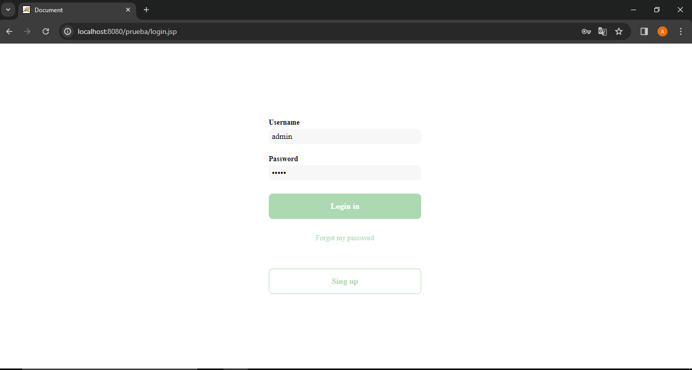
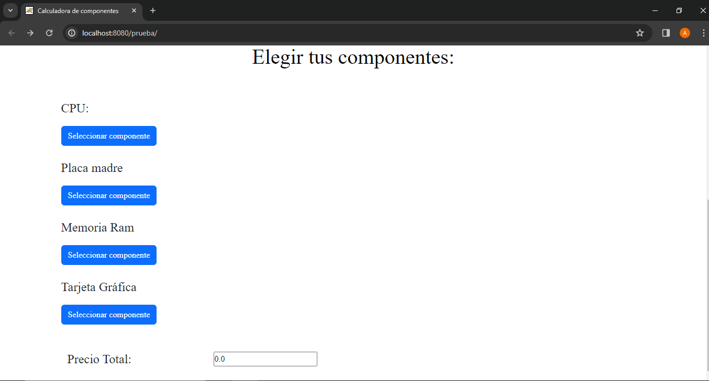
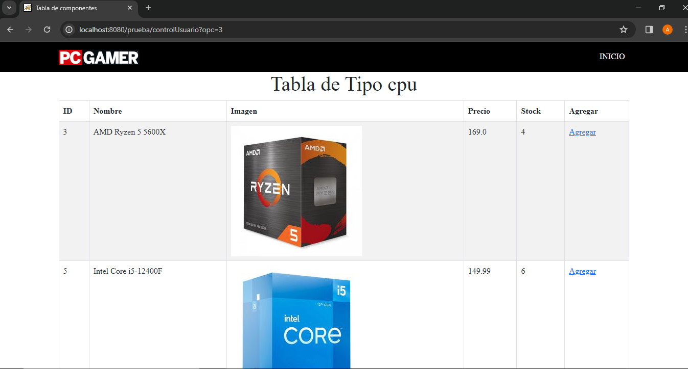
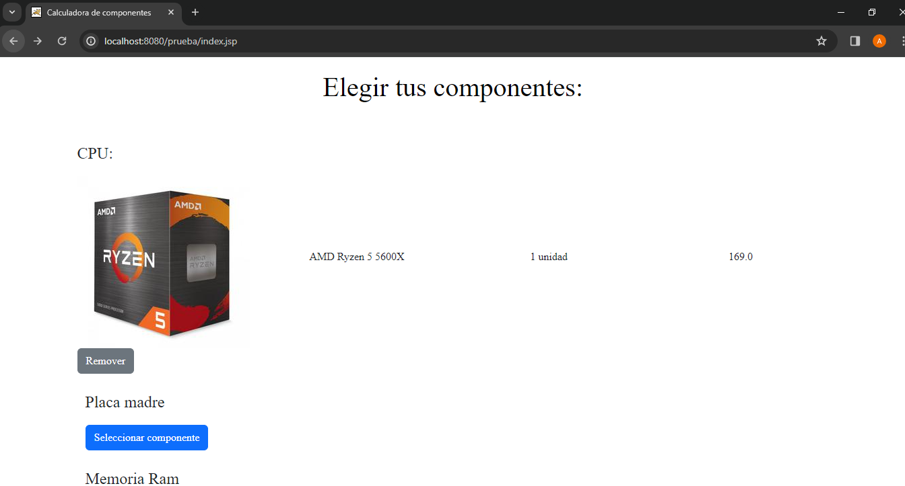
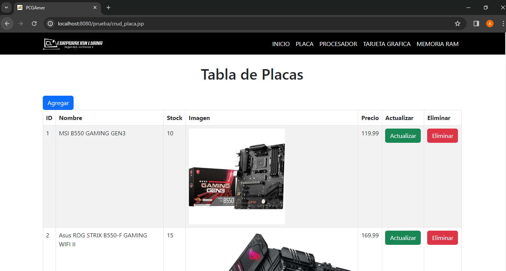

# Página web de componentes de PC
## Inicio de Sesión:
En esta sección, presentamos la página de inicio de sesión que proporciona acceso seguro al sistema.

## Selección de Componentes:
La página principal permite la selección de los componentes esenciales para tu PC.

Después de seleccionar al boton, los usuarios son dirigidos a una página donde pueden personalizar aún más sus elecciones.

Una vez seleccionados los componentes, la plataforma muestra un listado de opciones compatibles, específicamente vinculadas al procesador (CPU) elegido.

## Gestión de Componentes:
Dentro de la sección dedicada al mantenimiento (CRUD), el administrador pueden agregar, eliminar y actualizar componentes de su configuración.

